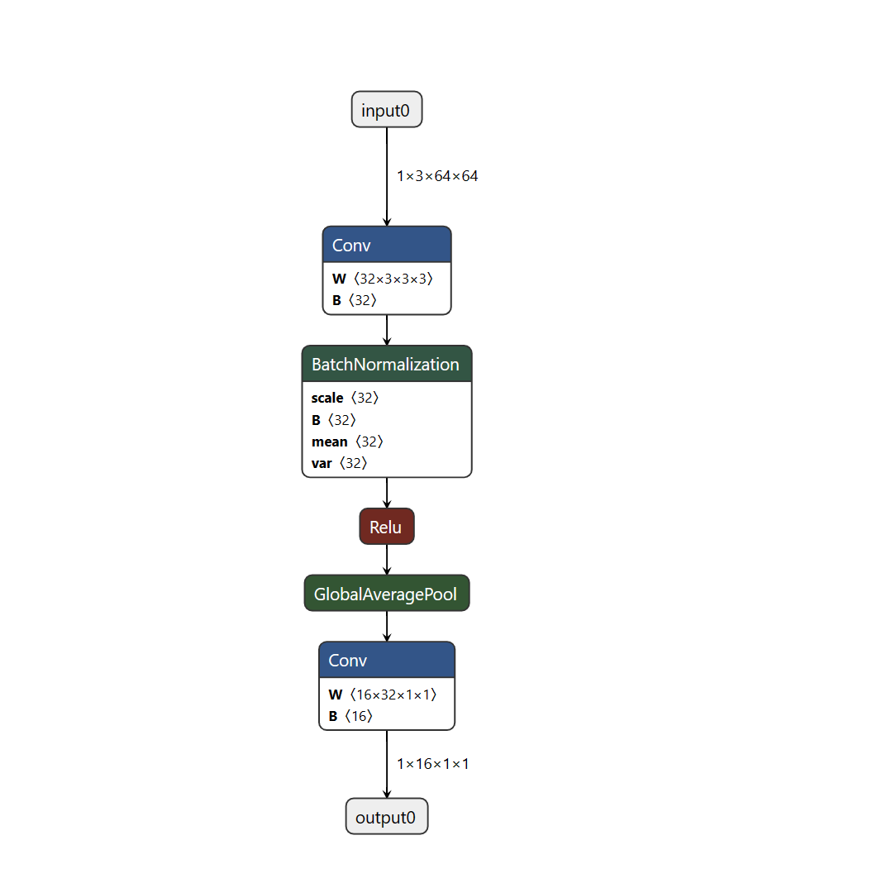
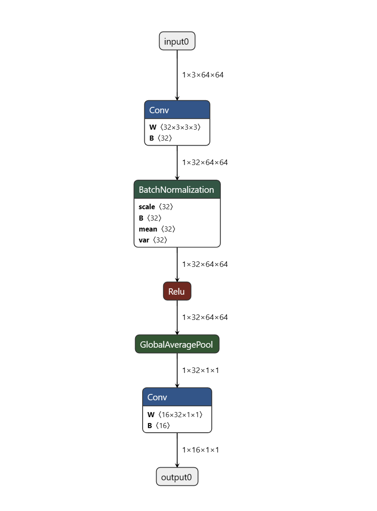

```python
# 理解onnx中的组织结构
#   - ModelProto (描述的是整个模型的信息)
#   --- GraphProto (描述的是整个网络的信息)
#   ------ NodeProto (描述的是各个计算节点，比如conv, linear)
#   ------ TensorProto (描述的是tensor的信息，主要包括权重)
#   ------ ValueInfoProto (描述的是input/output信息)
#   ------ AttributeProto (描述的是node节点的各种属性信息)
```

---

```python
model = onnx.shape_inference.infer_shapes(model)
```

`onnx.shape_inference.infer_shapes` 是一个在 Open Neural Network Exchange (ONNX) 模型中用来推断节点输出形状的工具。`infer_shapes` 函数的作用是增强模型的可读性和可执行性，特别是在不同的深度学习和推理框架之间转换模型的时候。

`onnx.shape_inference.infer_shapes` 的功能包括：

1. **形状推断**：它通过分析模型的图结构和每个节点的操作定义，自动计算和填充模型中所有张量的形状。这对于验证模型的正确性非常有用，因为它可以帮助检测维度不匹配和其他形状相关的错误。

2. **模型优化和验证**：在模型转换或优化过程中，推断出的形状信息可以用来进行进一步的模型验证，确保转换过程没有引入错误。

3. **提高兼容性**：在将模型部署到支持 ONNX 的不同推理引擎时，拥有明确的形状信息可以提高模型的兼容性，因为某些推理引擎可能需要明确的输入和输出形状信息才能正确执行模型。

4. **简化模型理解**：为模型的每个节点提供明确的形状信息，可以帮助开发者和工程师更好地理解模型的结构，特别是在处理复杂的模型时。

使用 `onnx.shape_inference.infer_shapes` 不仅有助于确保模型的正确性，还可以在跨框架转换和部署模型时起到关键作用，特别是在需要精确控制数据流经网络各层的形状时。

- before shape_inference



- after shape_inference


