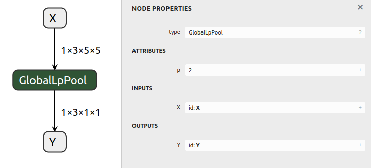

# 创建 ONNX 模型

## 概述

ONNX GraphSurgeon 提供了一个中间表示（IR），可以直接导出为 ONNX 格式。此外，IR 还带有一个简便的 API，方便用户手动构建模型图。

在本示例中，我们将生成一个包含 GlobalLpPool 节点的 ONNX 模型。

## 示例运行

执行以下命令生成模型，并将其保存为 `test_globallppool.onnx` 文件：

```bash
python3 example.py
```

生成的模型结构如下：



---

## GlobalLpPool这个算子的作用是什么

`GlobalLpPool`算子是一种在深度学习中使用的池化（pooling）操作，特别是在卷积神经网络（CNN）中。它的主要作用是对输入数据进行全局池化操作，以降低数据的维度（通常是空间维度），同时保留重要的信号特征。这种池化操作有助于减少计算量，提高模型的泛化能力，并减少过拟合的风险。

`GlobalLpPool`的具体作用可以根据Lp范数的不同有不同的表现形式，但它们的共同点是在整个输入特征图（如一个卷积层的输出）上进行操作，而不是像传统池化操作（如最大池化或平均池化）那样在局部窗口上进行。这意味着每个特征图（channel）会被压缩成单个数值，从而大大降低了特征的空间维度。

对于`GlobalLpPool`算子，其中`p`表示Lp范数的阶数，定义了池化操作的具体形式：

- 当`p=1`时，执行的是全局L1池化，即对每个通道的所有元素求绝对值之和。
- 当`p=2`时，执行的是全局L2池化，即对每个通道的所有元素求平方和的平方根，这可以理解为计算每个通道上元素的欧几里得距离。
- 对于其他`p`值，执行的是相应的Lp范数池化，按照Lp范数的定义进行计算。

这种全局Lp池化操作特别适用于需要减少特征维度，同时在全局范围内保留信号强度信息的场景，例如，在处理图像或序列数据时，作为特征提取和降维的一步。在某些情况下，全局Lp池化可以作为卷积层之后的最终层使用，直接将空间维度的数据压缩为对每个通道的全局统计信息，从而为分类或其他任务提供输入。
