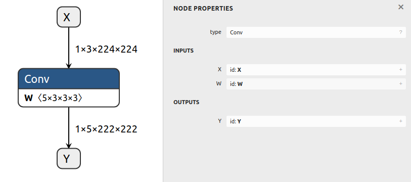

# 创建包含初始化器的 ONNX 模型

## 概述

本示例展示了如何生成一个包含卷积节点（带有权重）的 ONNX 模型。

**ONNX GraphSurgeon 中的 `Constant` 常量会自动被导出为 ONNX 模型中的初始化器。**

## 示例运行

执行以下命令可以生成模型，并将其保存为 `test_conv.onnx` 文件：

```bash
python3 example.py
```

生成的模型将类似如下：




