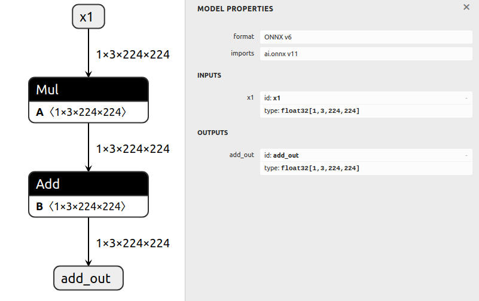

# 子图隔离

## 概述

该示例首先生成一个基本模型，然后从中提取一个特定的子图。

**要从模型中隔离子图，只需调整输入输出，**
**执行 `graph.cleanup()` 清理图表后，再重新导出即可。**

我们**不需要**预先知道具体的节点、初始化器或中间张量——只需标记输入和输出，ONNX GraphSurgeon 会自动推断其他细节。

## 示例运行步骤

1. 运行以下命令，生成一个包含多个节点的模型，并保存为 `model.onnx`：

   ```bash
   python3 generate.py
   ```

   生成的模型将执行计算 `Y = x0 + (a * x1 + b)`：

   

2. 隔离子图 `(a * x1 + b)`，并将其保存为 `subgraph.onnx`，运行命令如下：

   ```bash
   python3 isolate.py
   ```

   生成的子模型将执行计算 `add_out = (a * x1 + b)`：

   

---

```shell
OrderedDict([('x0', Variable (x0): (shape=[1, 3, 224, 224], dtype=float32)), ('x1', Variable (x1): (shape=[1, 3, 224, 224], dtype=float32)), ('a', Constant (a): (shape=[1, 3, 224, 224], dtype=float32)
LazyValues (shape=[1, 3, 224, 224], dtype=float32)), ('mul_out', Variable (mul_out): (shape=None, dtype=None)), ('b', Constant (b): (shape=[1, 3, 224, 224], dtype=float32)
LazyValues (shape=[1, 3, 224, 224], dtype=float32)), ('add_out', Variable (add_out): (shape=None, dtype=None)), ('Y', Variable (Y): (shape=[1, 3, 224, 224], dtype=float32))])
```

`LazyValues` 是与ONNX GraphSurgeon库相关的一个术语，它指的是在图的构造阶段，某些张量（tensor）的值是延迟计算的，也就是说，这些值并不是立即计算出来的，而是等到需要的时候才计算。这种机制在处理复杂的图转换和优化时非常有用，因为它允许图的构建者在不立即计算或确定所有张量值的情况下，构造和修改图结构。
