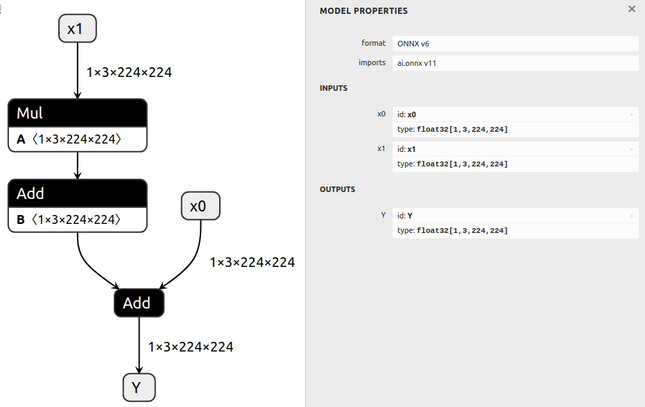

# 修改 ONNX 模型

## 概述

该示例展示了如何生成一个基本模型，并通过各种方式对模型进行修改。

通过将 ONNX 图导入ONNX GraphSurgeon IR，我们可以对图中的各个元素进行修改，最后将修改后的 IR 重新导出为 ONNX 模型。

## 示例运行步骤

1. 生成包含多个节点的模型，并将其保存为 `model.onnx`，命令如下：
    ```bash
    python3 generate.py
    ```

    生成的模型计算公式为 `Y = x0 + (a * x1 + b)`：

    

2. 对模型进行多种方式的修改，并将其保存为 `modified.onnx`，命令如下：
    ```bash
    python3 modify.py
    ```

    该脚本的主要修改如下：
    - 移除第一个 `Add` 节点的 `b` 输入
    - 将第一个 `Add` 操作替换为 `LeakyRelu`
    - 在第一个 `Add` 之后插入 `Identity` 节点
    - 将模型的输出更改为 `Identity` 节点的输出
    - 运行 `cleanup()`，清理由于输出修改而未使用的 `x0` 张量和第二个 `Add` 节点。

    修改后的模型计算结果为 `identity_out = leaky_relu(a * x1)`：

    

---

### graph.node输出结果

```shell
[ (Mul)
	Inputs: [
		Constant (a): (shape=[1, 3, 224, 224], dtype=float32)
		Variable (x1): (shape=[1, 3, 224, 224], dtype=float32)
	]
	Outputs: [
		Variable (mul_out): (shape=None, dtype=None)
	],  (Add)
	Inputs: [
		Variable (mul_out): (shape=None, dtype=None)
		Constant (b): (shape=[1, 3, 224, 224], dtype=float32)
	]
	Outputs: [
		Variable (add_out): (shape=None, dtype=None)
	],  (Add)
	Inputs: [
		Variable (x0): (shape=[1, 3, 224, 224], dtype=float32)
		Variable (add_out): (shape=None, dtype=None)
	]
	Outputs: [
		Variable (Y): (shape=[1, 3, 224, 224], dtype=float32)
	]]
```

### first_add.inputs的输出结果

```shell
[Variable (mul_out): (shape=None, dtype=None), Constant (b): (shape=[1, 3, 224, 224], dtype=float32)
LazyValues (shape=[1, 3, 224, 224], dtype=float32)]
```

