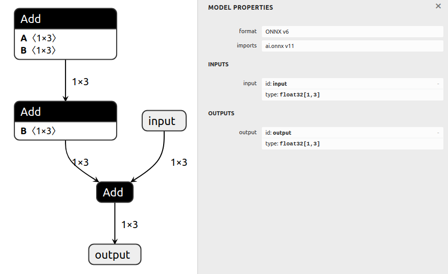
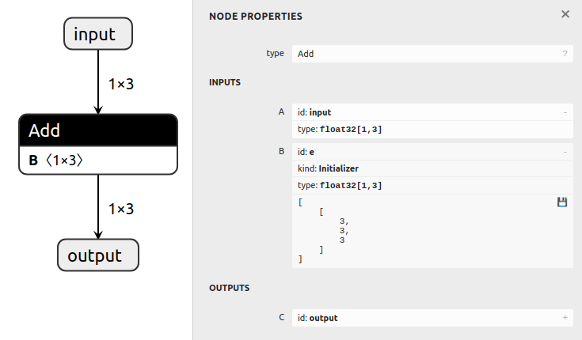
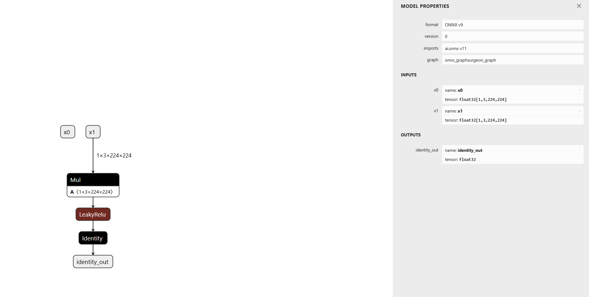
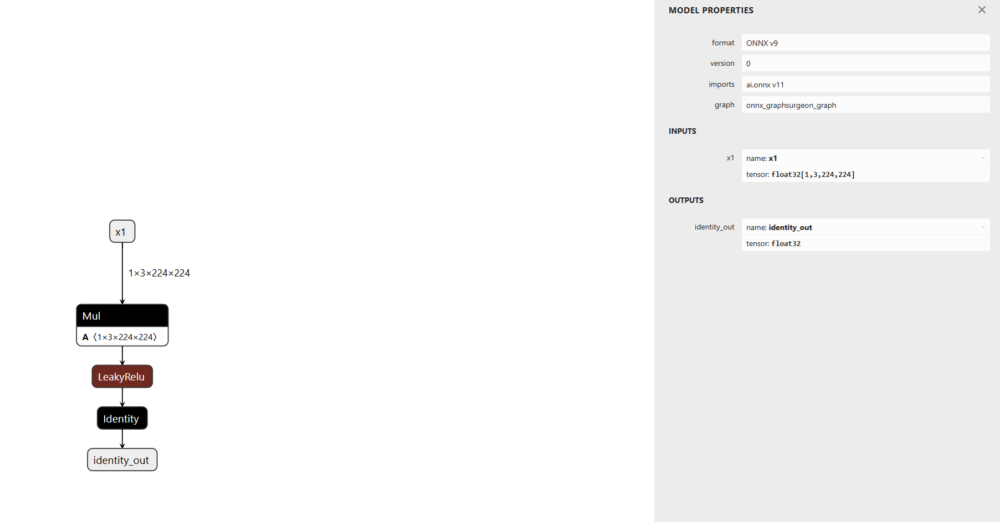

# 常量折叠

## 概述

常量折叠是指预先计算不依赖于运行时的表达式。这意味着 ONNX GraphSurgeon 图中，所有仅依赖常量 `Constant` 的节点都可以被折叠成更简单的表达式。

**ONNX GraphSurgeon 的常量折叠功能有一个局限：它不会重新排列节点顺序（即不具备交换律）。假设 `x` 是图的输入，`c0`、`c1` 和 `c2` 是图中的常量：**

- `x + (c0 + (c1 + c2))` **可以**被折叠
- `((x + c0) + c1) + c2` **无法**被折叠，尽管它与前者在数学上是等价的（如果不考虑浮点运算的舍入误差）。

## 准备工作

1. ONNX GraphSurgeon 使用 [ONNX Runtime](https://github.com/microsoft/onnxruntime) 来计算图中的常量表达式，可以通过以下命令安装：
   ```bash
   python3 -m pip install onnxruntime
   ```

## 示例运行步骤

1. 通过运行以下命令生成包含多个节点的模型，并将其保存为 `model.onnx`：

   ```bash
   python3 generate.py
   ```
   生成的模型执行计算 `output = input + ((a + b) + d)`，其中 `a`、`b` 和 `d` 均为值为 `1` 的常量：

   

2. 折叠图中的常量，并通过以下命令将其保存为 `folded.onnx`：

   ```bash
   python3 fold.py
   ```
   这将把表达式 `((a + b) + d)` 折叠为一个常量张量（值为 `3`）。折叠后的图计算公式为 `output = input + e`，其中 `e = ((a + b) + d)`：

   此脚本还会显示 `Graph.fold_constants()` 方法的帮助信息。

   

- before



- after

```python
# 实做的时候发现input:x2并没有删去,要加下面这段代码
fisrtMul = [node for node in graph.nodes if node.op == "Mul"][0]
graph.inputs = [inp for inp in fisrtMul.inputs if inp.name != "a"]
```


