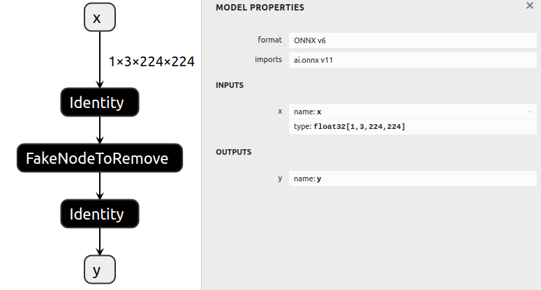

# 删除节点

## 概述

该示例展示了如何生成一个基础模型，然后删除其中的一个中间节点，并重新连接图中的剩余节点。

删除节点的方式是将该节点的输入和输出重新连接起来，并移除其与输出的关联。

## 节点删除的基本原理

假设有如下结构的计算图：

     Node0
       |
    Tensor0
       |
     Node1
       |
    Tensor1
       |
     Node2
       |
    Tensor2

如果要移除 **`Node1`**，
1. **将 `Node0` 的输出从 `[Tensor0]` 改为 `[Tensor1]`。**
2. **将 `Node1` 的输出从 `[Tensor1]` 改为 `[]`。**

修改后的图结构如下：

     Node0
       |
    Tensor1       Tensor0
       |             |
     Node2         Node1
       |
    Tensor2

**注意，`Node1` 仍然存在于图中。**
**这一点可以通过执行 `cleanup()` 函数来解决。**

## 示例运行步骤

1. 通过运行以下命令生成包含多个节点的模型，并将其保存为 `model.onnx`：
    ```bash
    python3 generate.py
    ```

    生成的模型包含几个 `identity` 层和一个将被移除的假节点。

    

2. 删除假节点，并通过运行以下命令将其保存为 `removed.onnx`：
    ```bash
    python3 remove.py
    ```

    

---

这个 `i()` 函数是 `onnx_graphsurgeon` 库中的一个辅助函数，用于获取当前节点的输入张量的生产节点（Producer Node）。在 ONNX 模型中，每个节点通常有输入张量和输出张量，输入张量来自其他节点的输出，因此这些节点被称为“生产节点”（Producer Nodes）。通过这个函数，我们可以方便地获取与当前节点相连的上游节点。

下面是对函数的详细解释：

### 函数功能

`i()` 函数的作用是获取当前节点的某个输入张量的生产节点。通常，一个张量只有一个生产节点，但在某些特殊情况下，张量可能由多个节点生成。这个函数允许你通过索引来访问生产节点。

### 参数说明

- **`tensor_idx`** (`int`):  
  这是当前节点的输入张量的索引。默认值是 `0`，即获取第一个输入张量的生产节点。如果当前节点有多个输入张量，你可以通过改变 `tensor_idx` 的值来指定不同的输入张量。
  
- **`producer_idx`** (`int`):  
  这是输入张量的生产节点的索引。默认值是 `0`，即获取当前输入张量的第一个生产节点。如果一个张量有多个生产节点，可以通过调整 `producer_idx` 来选择特定的生产节点。

### 返回值

- **`Node`**:  
  函数返回的是一个 ONNX 图中的节点（`Node` 对象），这个节点是指定输入张量的生产者节点。

### 示例解释

1. **`node.i()` 等价于 `node.inputs[0].inputs[0]`**：
   - `node.i()` 获取的是 `node` 的第一个输入张量的生产节点。
   - `node.inputs[0]` 表示当前节点的第一个输入张量。
   - `node.inputs[0].inputs[0]` 则表示该输入张量的生产节点。
   - 因此 `node.i()` 就相当于获取当前节点的第一个输入张量的第一个生产节点。

2. **`node.i(1, 2)` 等价于 `node.inputs[1].inputs[2]`**：
   - `node.i(1, 2)` 获取的是 `node` 的第二个输入张量的第三个生产节点（索引从0开始）。
   - `node.inputs[1]` 表示当前节点的第二个输入张量。
   - `node.inputs[1].inputs[2]` 则表示该输入张量的第三个生产节点。

---

`o()` 函数是 `onnx_graphsurgeon` 中的一个便捷函数，用来获取当前节点输出张量的“消费者节点”（Consumer Node）。在 ONNX 模型中，节点输出张量会被其他节点使用，这些使用输出张量的节点就是消费者节点。通过这个函数，你可以方便地找到那些接收当前节点输出的下游节点。

### 函数功能

`o()` 函数的作用是获取当前节点输出张量的消费者节点。ONNX 节点的输出张量可能被多个下游节点使用，消费者节点的索引可以用来精确指定哪个节点是该输出张量的消费者。

### 参数说明

- **`consumer_idx`** (`int`):  
  这是消费者节点的索引。默认值是 `0`，表示获取第一个消费者节点。如果输出张量被多个节点消费（使用），可以通过改变 `consumer_idx` 来选择不同的消费者节点。
  
- **`tensor_idx`** (`int`):  
  这是当前节点输出张量的索引。默认值是 `0`，即获取第一个输出张量的消费者节点。如果当前节点有多个输出张量，可以通过改变 `tensor_idx` 的值来指定不同的输出张量。

### 返回值

- **`Node`**:  
  函数返回的是一个 ONNX 图中的节点（`Node` 对象），该节点是指定输出张量的消费者节点。

### 示例解释

1. **`node.o()` 等价于 `node.outputs[0].outputs[0]`**：
   - `node.o()` 获取的是 `node` 的第一个输出张量的第一个消费者节点。
   - `node.outputs[0]` 表示当前节点的第一个输出张量。
   - `node.outputs[0].outputs[0]` 则表示第一个输出张量的第一个消费者节点。
   - 因此 `node.o()` 就相当于获取当前节点的第一个输出张量的第一个消费者节点。

2. **`node.o(2, 1)` 等价于 `node.outputs[1].outputs[2]`**：
   - `node.o(2, 1)` 获取的是 `node` 的第二个输出张量的第三个消费者节点（索引从0开始）。
   - `node.outputs[1]` 表示当前节点的第二个输出张量。
   - `node.outputs[1].outputs[2]` 则表示该输出张量的第三个消费者节点。

### 用途

这个函数的主要用途是简化获取输出张量的消费者节点的过程。通常，ONNX 模型中的某个节点的输出可能会被多个其他节点使用，这些使用者节点被称为消费者节点。通过 `o()` 函数，可以直接获取这些下游节点，而不需要手动遍历输出张量和其对应的消费者节点。

`o()` 函数与 `i()` 函数相对应，`i()` 用于获取输入张量的生产者节点，而 `o()` 则用于获取输出张量的消费者节点。通过这两个函数，可以方便地遍历 ONNX 计算图中的节点连接关系。

### 代码逻辑

1. **`self.outputs[tensor_idx]`**: 这是获取当前节点的第 `tensor_idx` 个输出张量。
2. **`self.outputs[tensor_idx].outputs[consumer_idx]`**: 这是获取该输出张量的第 `consumer_idx` 个消费者节点。

这样，通过设置不同的 `tensor_idx` 和 `consumer_idx`，可以快速找到输出张量的下游节点。
