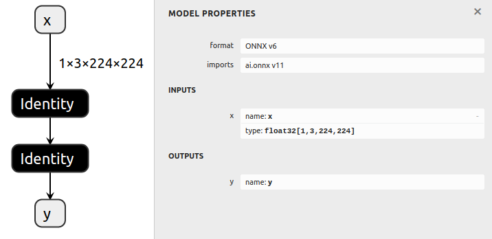

# Removing A Node

## Introduction

This example first generates a basic model, and then removes a node in the
middle of the model, and reconnects the remaining nodes in the graph.

In order to remove a node, we replace the output tensors of its input node
with its own outputs, and then remove its own connection to its outputs.

## Node Removal Basics

For example, for a graph with the following structure:

     Node0
       |
    Tensor0
       |
     Node1
       |
    Tensor1
       |
     Node2
       |
    Tensor2

In order to remove **`Node1`**,
1. **Change `Node0`'s outputs to `[Tensor1]` instead of `[Tensor0]`.**
2. **Change `Node1`'s outputs to `[]` instead of `[Tensor1]`**

The resulting graph looks like this:

     Node0
       |
    Tensor1       Tensor0
       |             |
     Node2         Node1
       |
    Tensor2

**Note that `Node1` remains in the graph.**
**This is easily remedied by running the `cleanup()` function.**

## Running the example

1. Generate a model with several nodes and save it to `model.onnx` by running:
    ```bash
    python3 generate.py
    ```

    The generated model includes a couple identity layers and a fake node that will be removed.

    

2. Remove the fake node, and save it to `removed.onnx` by running:
    ```bash
    python3 remove.py
    ```

    

---

```python
def i(self, tensor_idx=0, producer_idx=0):
        """
        Convenience function to get a producer node of one of this node's input tensors.
        Note that the parameters are swapped compared to the o() function; this is because tensors are likely to have only a single producer

        For example:
        ::

            assert node.i() == node.inputs[0].inputs[0]
            assert node.i(1, 2) == node.inputs[1].inputs[2]

        Args:
            tensor_idx (int): The index of the input tensor of this node. Defaults to 0.
            producer_idx (int): The index of the producer of the input tensor, if the tensor has multiple producers. Defaults to 0

        Returns:
            Node: The specified producer (input) node.
        """
        return self.inputs[tensor_idx].inputs[producer_idx]

    def o(self, consumer_idx=0, tensor_idx=0):
        """
        Convenience function to get a consumer node of one of this node's output tensors.

        For example:
        ::

            assert node.o() == node.outputs[0].outputs[0]
            assert node.o(2, 1) == node.outputs[1].outputs[2]

        Args:
            consumer_idx (int): The index of the consumer of the input tensor. Defaults to 0.
            tensor_idx (int): The index of the output tensor of this node, if the node has multiple outputs. Defaults to 0.

        Returns:
            Node: The specified consumer (output) node
        """
        return self.outputs[tensor_idx].outputs[consumer_idx]
```

在典型的深度学习框架和计算图模型中，一个输入张量通常只有一个直接的生产者节点，即只有一个节点负责生成这个张量。这是因为每个张量都是由某个特定的运算或节点产生，代表了那个运算的输出。

然而，存在一些情况和高级用法，例如在图优化或特定的并行计算模式中，一个逻辑上的“输入张量”可能来源于多个节点的操作结果的合并或复制。这些情况比较特殊，不是标准的使用模式。

在大多数情况下，每个张量都可以清晰地追溯到一个单一的生产者节点。如果有需要表示一个张量由多个节点共同“生产”的情况，通常会通过引入额外的操作来明确这种关系，如使用特殊的合并、拼接或加和节点来明确表示多个输入的整合。

因此，虽然在理论上可以构造场景让一个张量有多个生产者，但在实践中，每个张量的生产通常都归因于单个节点，以保持计算图的清晰和简洁。

---

```python
fake_node.inputs[0]
Variable (i0): (shape=None, dtype=None)
fake_node.inputs[0].inputs
[ (Identity)
	Inputs:...e=None)
	]]
fake_node.inputs[0].inputs[0].inputs
[Variable (x): (shape...e=float32)]
```

