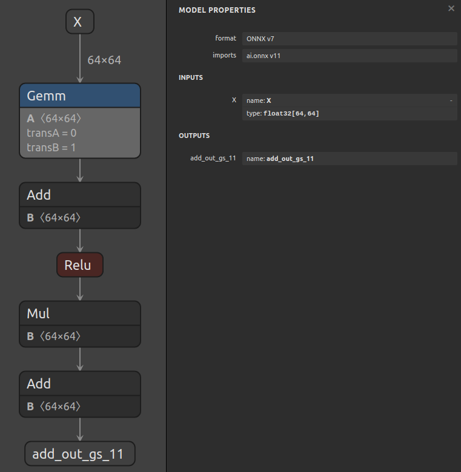
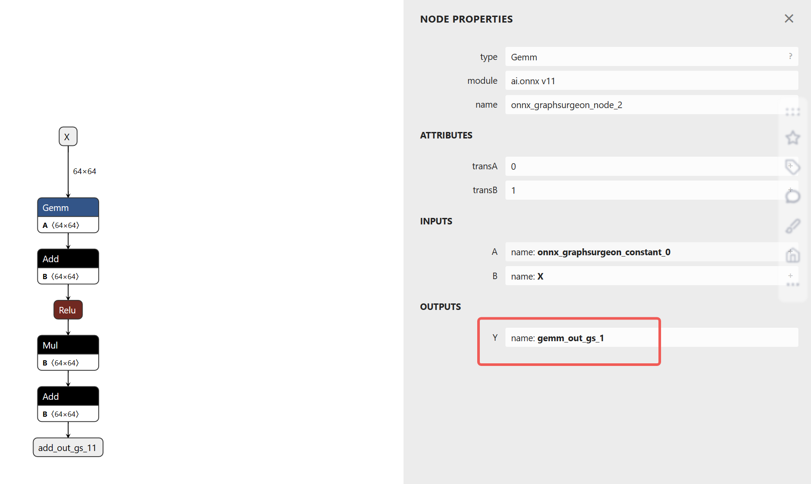

# 使用 Graph 层 API 构建模型

## 概述

此示例结合使用 `Graph.layer()` 函数与 `Graph.register()`，展示了**如何简化复杂 ONNX 模型的构建**。

**通过 `Graph.layer()` API，你可以更方便地向 `Graph` 中添加节点（Node）。** 该函数不仅能创建节点，还能生成输入和输出张量，并自动插入到图中。详情可查看 `Graph.layer()` 的帮助文档。

**提示**：你仍需要手动设置 `Graph` 的输入和输出。

你还可以使用 `Graph.layer()` 编写自定义函数，并通过 `Graph.register()` 注册。例如，编写如下函数以在图中插入一个 "Add" 操作：
```python
@gs.Graph.register()
def add(self, a, b):
    return self.layer(op="Add", inputs=[a, b], outputs=["add_out"])
```

然后可以像这样调用：
```python
[Y] = graph.add(*graph.add(X, B), C)
```

这段代码将在图中添加一组节点，计算 `Y = (X + B) + C`（假设 `X`、`B` 和 `C` 是图中的张量），**无需手动创建中间张量**。

## 示例运行步骤

1. 运行以下命令生成一个中等复杂的模型，并保存为 `model.onnx`：
    ```bash
    python3 generate.py
    ```

    此脚本还会展示 `Graph.layer()` 的帮助信息。

    生成的模型如下：

    

---

```py
@gs.Graph.register()
def mul(self, a, b):
    return self.layer(op="Mul", inputs=[a, b], outputs=["mul_out_gs"])


@gs.Graph.register()
def gemm(self, a, b, trans_a=False, trans_b=False):
    attrs = {"transA": int(trans_a), "transB": int(trans_b)}
    return self.layer(op="Gemm", inputs=[a, b], outputs=["gemm_out_gs"], attrs=attrs)
```

`mul`和`gemm`提供了不同层次的乘法操作，`mul`是逐元素的简单乘法，而`gemm`是更复杂的矩阵乘法操作，支持更广泛的线性代数应用，包括可选的矩阵转置功能。

---

```python
@gs.Graph.register()
def add(self, a, b):
    # The Graph.layer function creates a node, adds inputs and outputs to it, and finally adds it to the graph.
    # It returns the output tensors of the node to make it easy to chain.
    # The function will append an index to any strings provided for inputs/outputs prior
    # to using them to construct tensors. This will ensure that multiple calls to the layer() function
    # will generate distinct tensors. However, this does NOT guarantee that there will be no overlap with
    # other tensors in the graph. Hence, you should choose the prefixes to minimize the possibility of
    # collisions.
    return self.layer(op="Add", inputs=[a, b], outputs=["add_out_gs"])
```


