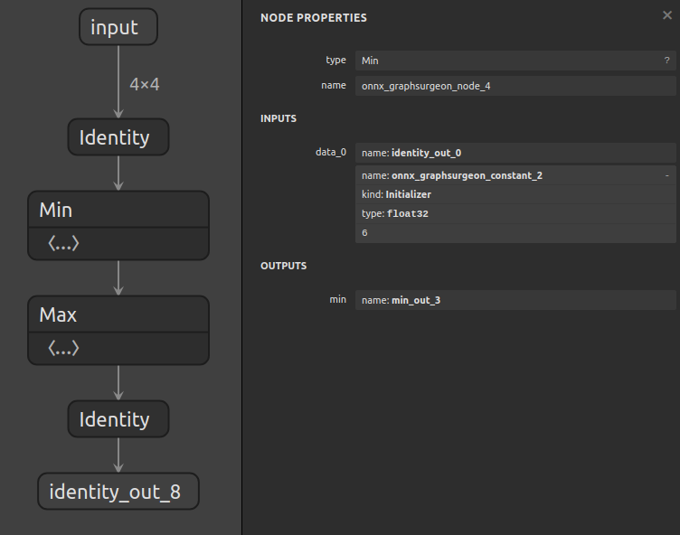
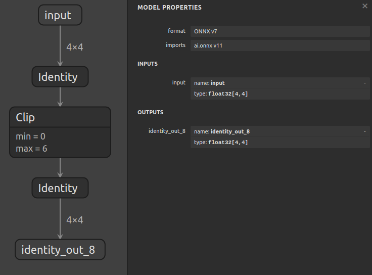

# 子图替换

## 概述

该示例首先生成一个包含 `Min` 和 `Max` 操作的模型，然后通过使用 `graph.layer()` 和 `graph.register()` API（详见 [示例07](../07_creating_a_model_with_the_layer_api)），创建一个函数将这个子图替换为 `Clip` 操作。

**这一功能对于在 ONNX 中启用 TensorRT 插件非常有帮助。**

## 子图替换的基本步骤

替换子图的过程可以分为三步。假设图的结构如下：

         Tensor0
            |
          Node0
            |
         Tensor1    Tensor2
               \    /
                Node1
                  |
               Tensor3
                  |
                Node2

**为了替换由 [`Node0`, `Node1`] 构成的子图，我们需要：**

1. 🍙**断开子图输入的输出：`Tensor0` 和 `Tensor2`**

    也就是删除 `Tensor0` 与 `Node0` 之间的连接，和 `Tensor2` 与 `Node1` 之间的连接。

2. 🥟**断开子图输出的输入：`Tensor3`**

    也就是删除 `Node1` 与 `Tensor3` 之间的连接。

此时，图的结构如下：

         Tensor0     Tensor2
    
               Tensor3
                  |
                Node2

以及已被断开的子图：

          Node0
            |
         Tensor1
               \
                Node1

3. 最后，我们需要插入一个新的节点，它的输入为 [`Tensor0`, `Tensor2`]，输出为 [`Tensor3`]。

完成这一步后，图的最终结构如下（执行 `cleanup()` 清理未使用的子图）：

         Tensor0     Tensor2
               \     /
              MyNewNode0
                  |
               Tensor3
                  |
                Node2

## 示例运行步骤

1. 通过以下命令生成包含 `Min` 和 `Max` 操作的模型：
    ```bash
    python3 generate.py
    ```

    生成的模型计算公式为 `max(min(x, 6), 0)`，结构如下：

    

2. 运行以下命令将子图替换为 `Clip` 操作：
    ```bash
    python3 replace.py
    ```

    最终生成的模型将包含 `clip(x, min=0, max=6)`，结构如下：

    