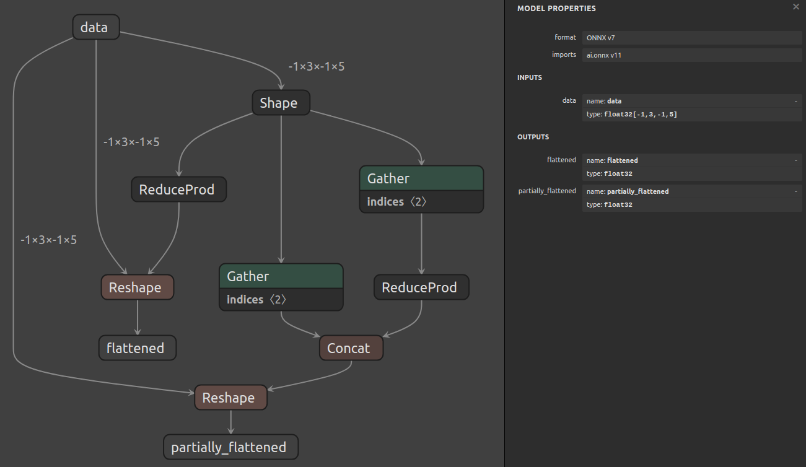

# Shape Operations With The Layer API

## Introduction

This example uses the layer API outlined in [example 07](../07_creating_a_model_with_the_layer_api/)
**to create a model that implements shape operations on inputs with dynamic shapes.**

Specifically, two common cases are outlined:

1. Flattening an input tensor that includes dynamic dimensions. The layers involved are:
    - `Shape`: to get the input shape.
    - `ReduceProd`: to compute the volume of the input shape.
    - `Reshape`: to change the shape of the input to its volume.

2. Collapsing some, but not all, dimensions of an input tensor that includes dynamic dimensions. The layers involved are:
    - `Shape`: to get the input shape.
    - `Gather`: to get the first 2 dimensions of the input shape.
    - `Gather`: to get the last 2 dimensions of the input shape.
    - `ReduceProd`: to compute the volume of the last 2 dimensions.
    - `Concat`: to combine the first dimension of the original shape with the volume of the other dimensions.
    - `Reshape`: to reshape the input based on the computed shape.

`ReduceProd`和`Gather`算子在深度学习和数据处理中扮演重要角色，分别提供了乘法归约和基于索引的数据选取功能。`ReduceProd`通过计算乘积来简化数据，而`Gather`则允许复杂的基于索引的数据重组，这两种操作在不同的场景下都非常有用。

## Running the example

1. Generate the model and save it to `model.onnx` by running:
    ```bash
    python3 generate.py
    ```

    The generated model will look like this:

    

## ReduceProd

`ReduceProd`是一个常见的数学操作，在深度学习框架和数值计算库中广泛使用。它计算输入张量（tensor）沿指定轴（axes）的元素乘积。这个操作对于各种数学和机器学习任务非常有用，比如在某些特定的统计计算或者乘积池化层（product pooling layers）中。下面是关于`ReduceProd`算子的更详细说明：

### 参数

- **输入张量**：`ReduceProd`作用的对象。它可以是任何形状和大小的张量。

- **轴（axes）**：一个整数或整数列表，指定要在其中进行乘积运算的维度。例如，如果输入是二维张量，指定轴为0将沿着列计算乘积，指定轴为1将沿着行计算乘积。如果不指定轴，则默认对整个张量进行操作。

- **keepdims**：一个布尔值，用于指示在输出张量中是否保持被缩减的维度。如果`keepdims`等于1，那么输出张量将保持与输入张量相同的秩（维度数量），被缩减的维度将以大小为1的维度出现在结果中。如果`keepdims`等于0，那么被缩减的维度将从输出张量中删除，导致输出张量的秩减少。

### 具体作用

- **元素乘积**：`ReduceProd`计算输入张量中所有指定轴上的元素乘积。例如，如果输入是一个形状为`(3, 4)`的二维张量，指定轴为1，则会计算每一行的所有元素的乘积，得到一个形状为`(3,)`的一维张量（如果`keepdims=0`）或形状为`(3, 1)`的二维张量（如果`keepdims=1`）。

- **空值集的处理**：如果对一个空的张量或指定的轴上没有元素进行`ReduceProd`操作，结果将定义为1，这是乘积操作的恒等元素。

### 使用场景举例

假设你有一个形状为`(2, 3)`的张量，内容如下：

```
[[1, 2, 3],
 [4, 5, 6]]
```

如果你对这个张量应用`ReduceProd`操作，指定轴为1（沿着行进行乘积），结果将是每行元素的乘积：

- 不保持维度（`keepdims=0`）：结果是一个形状为`(2,)`的张量，内容为`[6, 120]`，因为`1*2*3=6`且`4*5*6=120`。
- 保持维度（`keepdims=1`）：结果是一个形状为`(2, 1)`的张量，内容为`[[6], [120]]`。

`ReduceProd`是一个非常强大的算子，可以用于多种复杂的数学和机器学习操作中，包括但不限于几何平均的计算、某些特殊类型的归一化处理，或者在处理概率乘积时。


