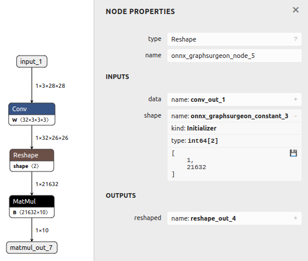

# 动态批次大小

## 概述

**本示例首先创建了一个具有静态批次大小的基础模型，**
**然后将其修改为支持动态批次大小。**

## 修改输入的批次大小
以下代码展示了如何将静态 ONNX 模型转换为动态批次大小模型：
```python
graph = gs.import_onnx(onnx_model)
for input in graph.inputs:
   input.shape[0] = 'N'
```

上述代码对于简单模型来说已足够。
**不过，有些模型还可能需要更新其内部层，例如静态的 `Reshape` 层。**
**有关这种情况的示例，请参见下面的部分。**

## 示例运行步骤

1. 通过以下命令生成一个具有静态输入形状和多个节点（包括静态 `Reshape` 操作）的模型，并将其保存为 `model.onnx`：
    ```bash
    python3 generate.py
    ```

    

2. 将模型转换为支持动态批次大小，并通过以下命令将其保存为 `modified.onnx`：
    ```bash
    python3 modify.py
    ```

    脚本将执行以下步骤：
    - **将输入的批次大小设置为 `N`（动态符号）**
    - **将 `Reshape` 层的形状更新为 `-1`（动态值）**

    修改后的模型将支持任意批次大小：

    